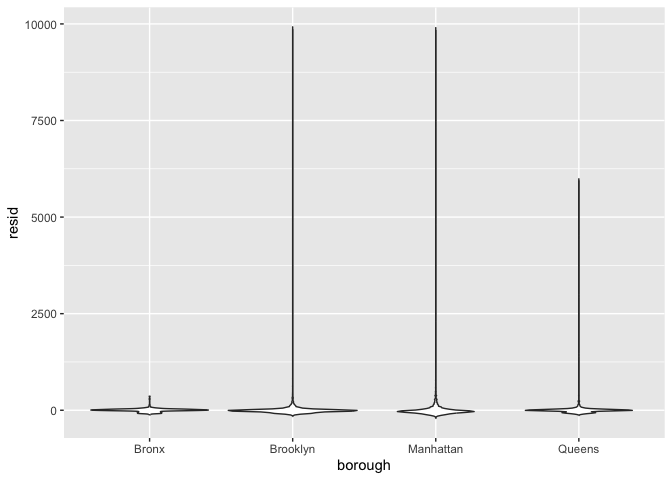
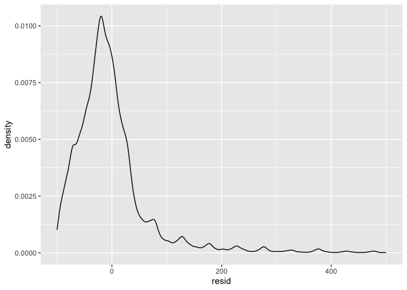

Linear Models
================

``` r
library(tidyverse)
```

    ## ── Attaching core tidyverse packages ──────────────────────── tidyverse 2.0.0 ──
    ## ✔ dplyr     1.1.3     ✔ readr     2.1.4
    ## ✔ forcats   1.0.0     ✔ stringr   1.5.0
    ## ✔ ggplot2   3.4.3     ✔ tibble    3.2.1
    ## ✔ lubridate 1.9.3     ✔ tidyr     1.3.0
    ## ✔ purrr     1.0.2     
    ## ── Conflicts ────────────────────────────────────────── tidyverse_conflicts() ──
    ## ✖ dplyr::filter() masks stats::filter()
    ## ✖ dplyr::lag()    masks stats::lag()
    ## ℹ Use the conflicted package (<http://conflicted.r-lib.org/>) to force all conflicts to become errors

``` r
library(p8105.datasets)
```

## Load and clean Airbnb data

``` r
data("nyc_airbnb")

nyc_airbnb = 
  nyc_airbnb |> 
  mutate(stars = review_scores_location / 2) |> 
  rename(
    borough = neighbourhood_group,
    neighborhood = neighbourhood) |> 
  filter(borough != "Staten Island") |> 
  select(price, stars, borough, neighborhood, room_type)
```

Let’s fit a model!

``` r
fit = 
  nyc_airbnb |>
  lm(price ~ stars + borough, data = _)
fit
```

    ## 
    ## Call:
    ## lm(formula = price ~ stars + borough, data = nyc_airbnb)
    ## 
    ## Coefficients:
    ##      (Intercept)             stars   boroughBrooklyn  boroughManhattan  
    ##           -70.41             31.99             40.50             90.25  
    ##    boroughQueens  
    ##            13.21

``` r
# same as:
lm(price ~ stars + borough, data = nyc_airbnb)
```

    ## 
    ## Call:
    ## lm(formula = price ~ stars + borough, data = nyc_airbnb)
    ## 
    ## Coefficients:
    ##      (Intercept)             stars   boroughBrooklyn  boroughManhattan  
    ##           -70.41             31.99             40.50             90.25  
    ##    boroughQueens  
    ##            13.21

Look at fit:

``` r
fit
```

    ## 
    ## Call:
    ## lm(formula = price ~ stars + borough, data = nyc_airbnb)
    ## 
    ## Coefficients:
    ##      (Intercept)             stars   boroughBrooklyn  boroughManhattan  
    ##           -70.41             31.99             40.50             90.25  
    ##    boroughQueens  
    ##            13.21

``` r
summary(fit) 
```

    ## 
    ## Call:
    ## lm(formula = price ~ stars + borough, data = nyc_airbnb)
    ## 
    ## Residuals:
    ##    Min     1Q Median     3Q    Max 
    ## -169.8  -64.0  -29.0   20.2 9870.0 
    ## 
    ## Coefficients:
    ##                  Estimate Std. Error t value Pr(>|t|)    
    ## (Intercept)       -70.414     14.021  -5.022 5.14e-07 ***
    ## stars              31.990      2.527  12.657  < 2e-16 ***
    ## boroughBrooklyn    40.500      8.559   4.732 2.23e-06 ***
    ## boroughManhattan   90.254      8.567  10.534  < 2e-16 ***
    ## boroughQueens      13.206      9.065   1.457    0.145    
    ## ---
    ## Signif. codes:  0 '***' 0.001 '**' 0.01 '*' 0.05 '.' 0.1 ' ' 1
    ## 
    ## Residual standard error: 181.5 on 30525 degrees of freedom
    ##   (9962 observations deleted due to missingness)
    ## Multiple R-squared:  0.03423,    Adjusted R-squared:  0.03411 
    ## F-statistic: 270.5 on 4 and 30525 DF,  p-value: < 2.2e-16

``` r
# gives IQR, residuals, all coefficients, SE, t-values, p-values
```

Tidy up output instead:

``` r
fit |> 
  broom::glance()
```

    ## # A tibble: 1 × 12
    ##   r.squared adj.r.squared sigma statistic   p.value    df   logLik    AIC    BIC
    ##       <dbl>         <dbl> <dbl>     <dbl>     <dbl> <dbl>    <dbl>  <dbl>  <dbl>
    ## 1    0.0342        0.0341  182.      271. 6.73e-229     4 -202113. 4.04e5 4.04e5
    ## # ℹ 3 more variables: deviance <dbl>, df.residual <int>, nobs <int>

tidy up coefficients:

``` r
fit |> 
  broom::tidy() |> 
  mutate(term = str_replace(term, "^borough", "Borough: ")) |> 
  select(term, estimate, p.value) |> 
  knitr::kable(digits = 3)
```

| term               | estimate | p.value |
|:-------------------|---------:|--------:|
| (Intercept)        |  -70.414 |   0.000 |
| stars              |   31.990 |   0.000 |
| Borough: Brooklyn  |   40.500 |   0.000 |
| Borough: Manhattan |   90.254 |   0.000 |
| Borough: Queens    |   13.206 |   0.145 |

``` r
# pulls coefficient table as a tibble (dataframe) -- easier to use
```

## Fit another model

``` r
fit = 
  nyc_airbnb |>
  mutate(
    borough = fct_infreq(borough),
    room_type = fct_infreq(room_type)) |> # makes manhattan reference and apt ref
  lm(price ~ stars + borough + room_type, data = _)

fit |> 
  broom::tidy()
```

    ## # A tibble: 7 × 5
    ##   term                  estimate std.error statistic  p.value
    ##   <chr>                    <dbl>     <dbl>     <dbl>    <dbl>
    ## 1 (Intercept)              113.      11.8       9.54 1.56e-21
    ## 2 stars                     21.9      2.43      9.01 2.09e-19
    ## 3 boroughBrooklyn          -40.3      2.15    -18.8  4.62e-78
    ## 4 boroughQueens            -55.5      3.59    -15.4  1.32e-53
    ## 5 boroughBronx             -63.0      8.22     -7.67 1.76e-14
    ## 6 room_typePrivate room   -105.       2.05    -51.2  0       
    ## 7 room_typeShared room    -129.       6.15    -21.0  2.24e-97

## Look at Diagnostics

``` r
modelr::add_residuals(nyc_airbnb, fit)
```

    ## # A tibble: 40,492 × 6
    ##    price stars borough neighborhood room_type        resid
    ##    <dbl> <dbl> <chr>   <chr>        <chr>            <dbl>
    ##  1    99   5   Bronx   City Island  Private room     45.0 
    ##  2   200  NA   Bronx   City Island  Private room     NA   
    ##  3   300  NA   Bronx   City Island  Entire home/apt  NA   
    ##  4   125   5   Bronx   City Island  Entire home/apt -33.9 
    ##  5    69   5   Bronx   City Island  Private room     15.0 
    ##  6   125   5   Bronx   City Island  Entire home/apt -33.9 
    ##  7    85   5   Bronx   City Island  Entire home/apt -73.9 
    ##  8    39   4.5 Bronx   Allerton     Private room     -4.09
    ##  9    95   5   Bronx   Allerton     Entire home/apt -63.9 
    ## 10   125   4.5 Bronx   Allerton     Entire home/apt -23.0 
    ## # ℹ 40,482 more rows

``` r
modelr::add_predictions(nyc_airbnb, fit)
```

    ## # A tibble: 40,492 × 6
    ##    price stars borough neighborhood room_type        pred
    ##    <dbl> <dbl> <chr>   <chr>        <chr>           <dbl>
    ##  1    99   5   Bronx   City Island  Private room     54.0
    ##  2   200  NA   Bronx   City Island  Private room     NA  
    ##  3   300  NA   Bronx   City Island  Entire home/apt  NA  
    ##  4   125   5   Bronx   City Island  Entire home/apt 159. 
    ##  5    69   5   Bronx   City Island  Private room     54.0
    ##  6   125   5   Bronx   City Island  Entire home/apt 159. 
    ##  7    85   5   Bronx   City Island  Entire home/apt 159. 
    ##  8    39   4.5 Bronx   Allerton     Private room     43.1
    ##  9    95   5   Bronx   Allerton     Entire home/apt 159. 
    ## 10   125   4.5 Bronx   Allerton     Entire home/apt 148. 
    ## # ℹ 40,482 more rows

Like many things in the tidyverse, the first argument is a dataframe.
That makes it easy to included steps adding residuals or predictions in
pipeline of commands to conduct inspections and perform diagnostics.

``` r
# violin plot
nyc_airbnb |> 
  modelr::add_residuals(fit) |> 
  ggplot(aes(x = borough, y = resid)) + 
  geom_violin()
```

    ## Warning: Removed 9962 rows containing non-finite values (`stat_ydensity()`).

<!-- -->

``` r
# scatter plot
nyc_airbnb |> 
  modelr::add_residuals(fit) |> 
  ggplot(aes(x = stars, y = resid)) + 
  geom_point()
```

    ## Warning: Removed 9962 rows containing missing values (`geom_point()`).

<!-- -->

``` r
#density plot
nyc_airbnb |> 
  modelr::add_residuals(fit) |> 
  ggplot(aes(x = resid)) + 
  geom_density() + 
  xlim(-100, 500)
```

    ## Warning: Removed 11681 rows containing non-finite values (`stat_density()`).

<!-- -->

## Hypothesis Test for categorical predictor

fit null and alternative model

``` r
fit_null =  lm(price ~ stars + borough, data = nyc_airbnb)
fit_alt =  lm(price ~ stars + borough + room_type, data = nyc_airbnb)

anova(fit_null, fit_alt) |> # compare models
  broom::tidy()
```

    ## # A tibble: 2 × 7
    ##   term                        df.residual    rss    df   sumsq statistic p.value
    ##   <chr>                             <dbl>  <dbl> <dbl>   <dbl>     <dbl>   <dbl>
    ## 1 price ~ stars + borough           30525 1.01e9    NA NA            NA       NA
    ## 2 price ~ stars + borough + …       30523 9.21e8     2  8.42e7     1394.       0

## Borough-level differences

``` r
fit = 
  nyc_airbnb |> 
  lm(price = stars*borough + room_type*borough, data = _) #whether price depends on stars & look at interactions
```

    ## Warning: In lm.fit(x, y, offset = offset, singular.ok = singular.ok, ...) :
    ##  extra argument 'price' will be disregarded

``` r
fit |> 
  broom::tidy()
```

    ## # A tibble: 184 × 5
    ##    term                          estimate std.error statistic  p.value
    ##    <chr>                            <dbl>     <dbl>     <dbl>    <dbl>
    ##  1 (Intercept)                    130.        39.4      3.30  0.000971
    ##  2 stars                            0.776      2.65     0.292 0.770   
    ##  3 boroughBrooklyn                 25.5       41.2      0.619 0.536   
    ##  4 boroughManhattan               107.        38.2      2.79  0.00532 
    ##  5 boroughQueens                   11.0       42.2      0.260 0.795   
    ##  6 neighborhoodArverne             20.5       29.0      0.708 0.479   
    ##  7 neighborhoodAstoria              7.45      20.6      0.363 0.717   
    ##  8 neighborhoodBath Beach         -16.2       72.2     -0.224 0.823   
    ##  9 neighborhoodBattery Park City   -6.26      30.3     -0.206 0.837   
    ## 10 neighborhoodBay Ridge          -14.4       27.2     -0.529 0.597   
    ## # ℹ 174 more rows

``` r
airbnb_lm =
  nyc_airbnb |> 
  nest(data = -borough) |> 
  mutate(
    models = map(data, \(df) lm(price ~ stars + room_type, data = df)),
    results = map(models, broom::tidy)) |> 
  select(-data, -models) |> 
  unnest(results)

airbnb_lm |> 
  select(borough, term, estimate) |> 
  mutate(term = fct_inorder(term)) |> 
  pivot_wider(
    names_from = term, values_from = estimate) |> 
  knitr::kable(digits = 2)
```

| borough   | (Intercept) | stars | room_typePrivate room | room_typeShared room |
|:----------|------------:|------:|----------------------:|---------------------:|
| Bronx     |       90.07 |  4.45 |                -52.91 |               -70.55 |
| Queens    |       91.58 |  9.65 |                -69.26 |               -94.97 |
| Brooklyn  |       69.63 | 20.97 |                -92.22 |              -105.84 |
| Manhattan |       95.69 | 27.11 |               -124.19 |              -153.64 |

Same, but a bit different

``` r
manhattan_airbnb =
  nyc_airbnb |> 
  filter(borough == "Manhattan")

manhattan_nest_lm_res =
  manhattan_airbnb |> 
  nest(data = -neighborhood) |> 
  mutate(
    models = map(data, \(df) lm(price ~ stars + room_type, data = df)), 
    # \(df) gives argument datafram --anonymous function that only exists in this line of code and not in the environment
    results = map(models, broom::tidy)) |> 
  select(-data, -models) |> 
  unnest(results)
```

## Homicides in Baltimore data

``` r
baltimore_df = 
  read_csv("data/homicide-data.csv") |> 
  filter(city == "Baltimore") |> 
  mutate(
    resolved = as.numeric(disposition == "Closed by arrest"),
    victim_age = as.numeric(victim_age),
    victim_race = fct_relevel(victim_race, "White")) |> 
  select(resolved, victim_age, victim_race, victim_sex)
```

    ## Rows: 52179 Columns: 12
    ## ── Column specification ────────────────────────────────────────────────────────
    ## Delimiter: ","
    ## chr (9): uid, victim_last, victim_first, victim_race, victim_age, victim_sex...
    ## dbl (3): reported_date, lat, lon
    ## 
    ## ℹ Use `spec()` to retrieve the full column specification for this data.
    ## ℹ Specify the column types or set `show_col_types = FALSE` to quiet this message.

Generalized Linear Model

``` r
fit_logistic = 
  baltimore_df |> 
  glm(resolved ~ victim_age + victim_race + victim_sex, data = _, family = binomial()) # binomial dist.

fit_logistic
```

    ## 
    ## Call:  glm(formula = resolved ~ victim_age + victim_race + victim_sex, 
    ##     family = binomial(), data = baltimore_df)
    ## 
    ## Coefficients:
    ##         (Intercept)           victim_age     victim_raceAsian  
    ##             1.19005             -0.00724              0.29635  
    ##    victim_raceBlack  victim_raceHispanic     victim_raceOther  
    ##            -0.84176             -0.26527             -0.76809  
    ##      victim_sexMale  
    ##            -0.87966  
    ## 
    ## Degrees of Freedom: 2826 Total (i.e. Null);  2820 Residual
    ## Null Deviance:       3676 
    ## Residual Deviance: 3589  AIC: 3603

look at model results

``` r
fit_logistic |> 
  broom::tidy() |> 
  mutate(OR = exp(estimate)) |>
  select(term, log_OR = estimate, OR, p.value) |> 
  knitr::kable(digits = 3)
```

| term                | log_OR |    OR | p.value |
|:--------------------|-------:|------:|--------:|
| (Intercept)         |  1.190 | 3.287 |   0.000 |
| victim_age          | -0.007 | 0.993 |   0.027 |
| victim_raceAsian    |  0.296 | 1.345 |   0.653 |
| victim_raceBlack    | -0.842 | 0.431 |   0.000 |
| victim_raceHispanic | -0.265 | 0.767 |   0.402 |
| victim_raceOther    | -0.768 | 0.464 |   0.385 |
| victim_sexMale      | -0.880 | 0.415 |   0.000 |

``` r
baltimore_df |> 
  modelr::add_predictions(fit_logistic) |> 
  mutate(fitted_prob = boot::inv.logit(pred))
```

    ## # A tibble: 2,827 × 6
    ##    resolved victim_age victim_race victim_sex    pred fitted_prob
    ##       <dbl>      <dbl> <fct>       <chr>        <dbl>       <dbl>
    ##  1        0         17 Black       Male       -0.654        0.342
    ##  2        0         26 Black       Male       -0.720        0.327
    ##  3        0         21 Black       Male       -0.683        0.335
    ##  4        1         61 White       Male       -0.131        0.467
    ##  5        1         46 Black       Male       -0.864        0.296
    ##  6        1         27 Black       Male       -0.727        0.326
    ##  7        1         21 Black       Male       -0.683        0.335
    ##  8        1         16 Black       Male       -0.647        0.344
    ##  9        1         21 Black       Male       -0.683        0.335
    ## 10        1         44 Black       Female      0.0297       0.507
    ## # ℹ 2,817 more rows
